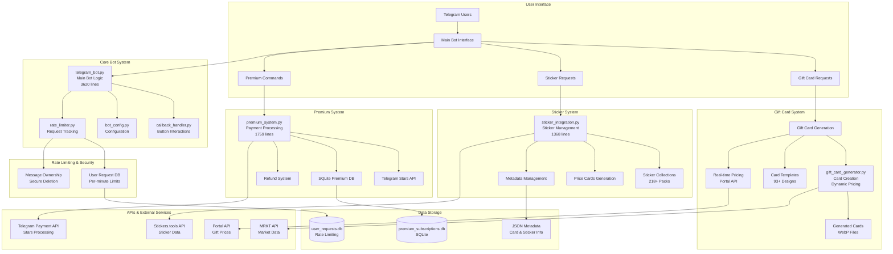

<p align="center">
  
</p>

<div align="center">

# GiftsChart Bot

### Every NFT Has a Price. Know It Live.

<br/>

[](https://t.me/GiftsChartBot)
[](https://www.python.org/)
[](LICENSE)
[](https://t.me/GiftsChartBot)
[](https://t.me/The01Studio)

</div>

<br/>

<div align="center">
  <a href="https://youtube.com/shorts/VdemjP__Um4?feature=share">
    
  </a>
  <br>
  <p><i>Click to watch GiftsChart in action</i></p>
</div>

<br/>

> [!TIP]
> **New!** Premium features now include custom referral links, branded price cards, and priority support. Get started with just 99 Stars for 30 days!

---

## Overview

GiftsChart is a powerful Telegram bot that brings **live gift price tracking** to your fingertips. Every Telegram gift and sticker has a price—now you can know it instantly, right in Telegram.

**Every NFT Has a Price. Know It Live.**

Get instant price cards with real-time market data, supply information, and direct marketplace links—all without leaving Telegram.

**Key Capabilities:**
- **Gift Price Cards**: Track 93+ Telegram gifts with live prices from Portal API
- **Sticker Price Cards**: Monitor 218+ sticker collections from Stickers.tools
- **Premium Features**: Custom referral links and branded cards for groups
- **Lightning Fast**: Cached responses with 30-minute refresh cycles
- **Spam Protection**: Built-in rate limiting and ownership verification
- **Live Data**: Real-time prices from Portal, MRKT, and Stickers.tools APIs

---

## Features

### Gift Tracking
Track any Telegram gift instantly. Just type the gift name in any chat:

- **Live Prices**: Real-time prices in Stars and USD
- **Supply Data**: Current and initial supply information
- **Market Links**: Direct links to Portal, MRKT, Tonnel, and Palace
- **Beautiful Cards**: Auto-generated cards with gift images and gradients
- **Smart Matching**: Fuzzy search finds gifts even with typos

### Sticker Collections
Browse and track 218+ sticker collections:

- **Collection Browser**: Organized by collection with pagination
- **Price Tracking**: Floor prices in Stars and USD
- **Supply Info**: Track availability and rarity
- **Marketplace Links**: Quick access to MRKT and Palace
- **Preview Images**: High-quality sticker previews

### Premium System
Unlock advanced features for your group:

- **Custom Referral Links**: Add your own MRKT, Palace, Tonnel, and Portal links
- **Branded Cards**: Your links appear on all price cards in your group
- **Priority Support**: Get help faster
- **No Ads**: Clean, distraction-free experience
- **30-Day Access**: Just 99 Stars (Telegram Stars)
- **3-Day Refund**: Full refund within 3 days if not satisfied

### Security & Performance
- **Rate Limiting**: Prevents spam and abuse
- **Message Ownership**: Only requesters can use buttons
- **Cached Data**: Fast responses with smart cache invalidation
- **Error Handling**: Graceful degradation when APIs are down
- **Database Backup**: Automatic Supabase backups every 6 hours

---

## System Architecture



---

## Usage

### Basic Commands

- `/start` - Welcome message and bot introduction
- `/gift <name>` - Get price card for a specific gift
- `/sticker` - Browse sticker collections
- `/premium` - Upgrade to premium features
- `/help` - Show help and available commands

### Inline Mode

Type `@GiftsChartBot <gift name>` in any chat to search and share gift cards instantly.

### Natural Language

Just type a gift name in any chat where the bot is present:
```
Plush Pepe
Diamond Ring
Astral Shard
```

The bot will automatically detect and respond with a price card!

---

## Premium Features

### How to Get Premium

1. Start a private chat with [@GiftsChartBot](https://t.me/GiftsChartBot)
2. Send `/premium` command
3. Pay 99 Stars (Telegram Stars)
4. Share your group with the bot
5. Add your custom referral links
6. Enjoy premium features for 30 days!

### What's Included

- **Custom Referral Links** - Add your MRKT, Palace, Tonnel, and Portal links
- **Branded Price Cards** - Your links appear on all cards in your group
- **Priority Support** - Get help faster from our team
- **No Ads** - Clean, distraction-free experience
- **30-Day Access** - Full month of premium features
- **3-Day Refund** - Not satisfied? Get a full refund within 3 days

---

## Project Structure

```
GiftsChart-ALL/
├── core/                    # Core bot functionality
│   ├── telegram_bot.py      # Main bot logic (3620 lines)
│   ├── callback_handler.py  # Button callbacks
│   ├── premium_system.py    # Premium features (1759 lines)
│   ├── rate_limiter.py      # Spam protection
│   └── bot_config.py        # Configuration
├── services/                # External API integrations
│   ├── portal_api.py        # Portal API client
│   ├── mrkt_api.py          # MRKT API client
│   ├── sticker_integration.py # Sticker functionality (1368 lines)
│   └── stickers_tools_api.py  # Stickers.tools API
├── generators/              # Card generation
│   ├── gift_card_generator.py
│   └── sticker_price_card_generator.py
├── schedulers/              # Background tasks
│   └── supabase_backup_sync.py
├── docs/                    # Documentation
│   ├── setup/               # Setup guides
│   ├── analysis/            # Technical docs
│   └── status/              # Status reports
└── assets/                  # Static assets
```

See [docs/PROJECT_STRUCTURE.md](docs/PROJECT_STRUCTURE.md) for detailed structure.

---

<div align="center">

### Built with love for the Telegram Community

*GiftsChart is currently in Production. We appreciate your feedback!*

<sub>Made by [@The01Studio](https://t.me/The01Studio)</sub>

</div>
